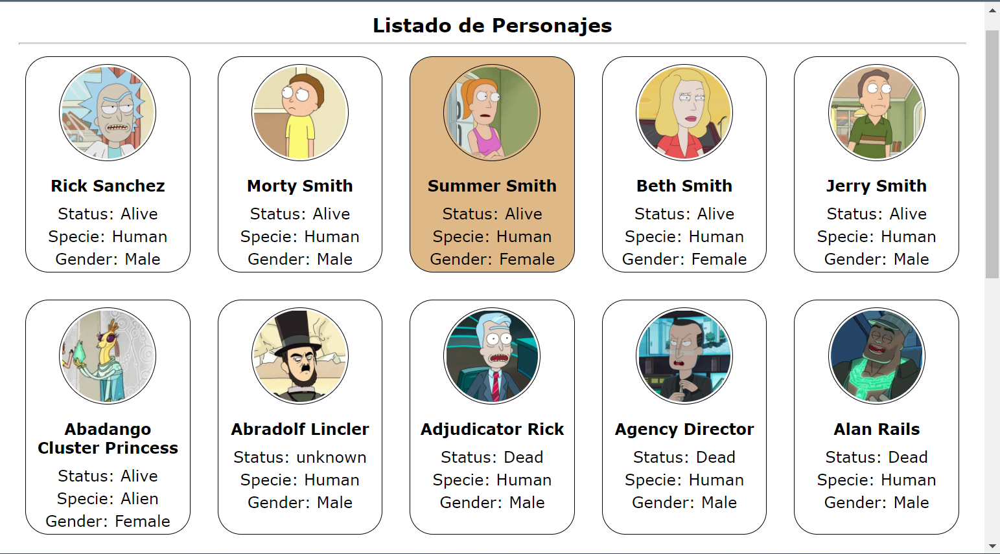

# Consumo de API REST con Angular 👌
## Instalación
###Clona
Repositorio
```
https://github.com/Edwingaviria/Consumo-de-Api-RickAndMorty.git
```
Pedimos a NPM que descargue las dependencias necesarias en node_modules/
```
$ npm install
```
## Iniciar App
```
$ ng serve -o
```
##### Listado de Personajes Web

##### Listado de Personajes Responsive

##### Detalle de Personaje

##### detalle de personaje con manejo de rutas


## Elaborado por
Angular

# Desarrollado por
Edwin Gaviria

